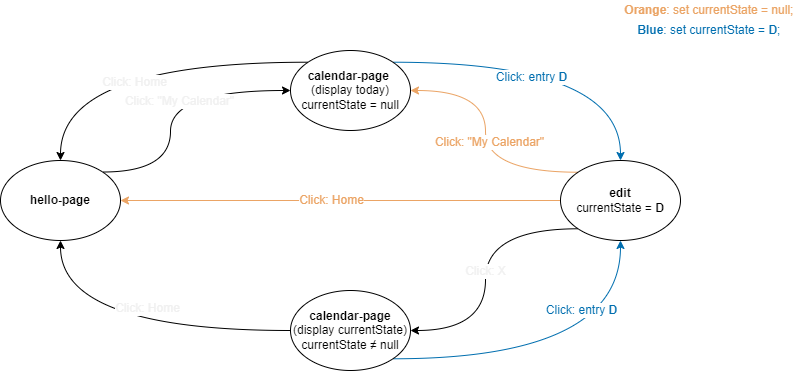

# {Decision on what components will be included for prompt user flow}

* Status: {accept}
* Deciders: {all team members} <!-- optional -->
* Date: {2022-11-15} <!-- optional -->

## Context and Problem Statement

Started from attempting to define how we should handle going from `edit-page` to `calendar-page`. We thought of using a `localStorage` variable with key value `currentState` to keep track of which date the user has clicked on on the calendar, so that the edit page knows which date to display.

From edit, if we click the X button, we should resume back to the calendar with the month-year that we were look at before. However, if we click 'My Calendar' on the nav bar, we should return back to the calendar but display today's month-year. This behavior wasn't defined clearly.

## Decision Drivers <!-- optional -->

* Avoid complex behaviors.

## Considered Options

* create a new `localStorage` variable that keeps track of whether we clicked on X or not from the edit page.
  * more organized, but not too nessesary.

* define a rigorous behavior using `currentState`. The initializers of the page will determine it's behavior based on what `currentState` is.

## Decision Outcome

We will define the behavior only using `currentState`. Here is a diagram.

## Pros and Cons of the Options <!-- optional -->

### Pros

We do not have to add another `localStorage` variable; not complex enough to add a new variable to keep track of.
